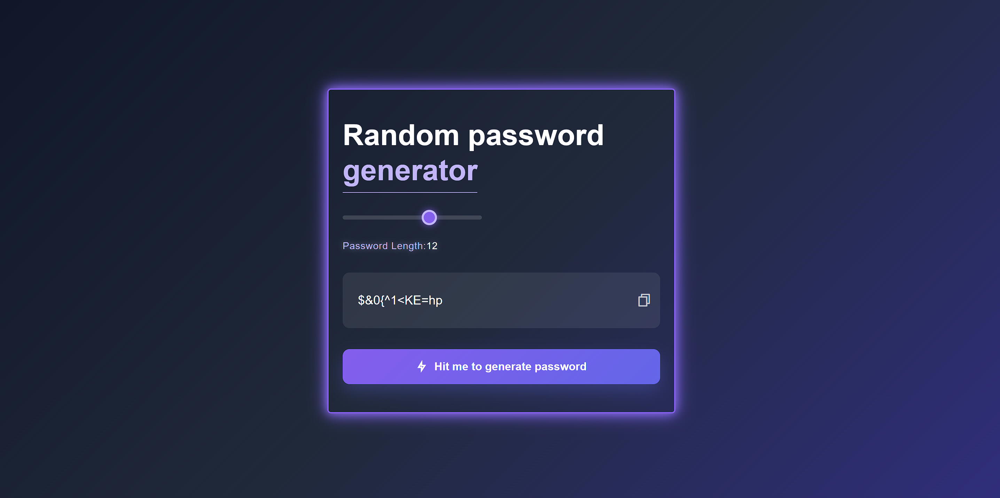

# 🔐 Random Password Generator

A modern and responsive Random Password Generator built using **HTML, CSS, and JavaScript**. This application allows users to generate strong and secure passwords instantly with customizable password lengths and one-click copy functionality.

## 🚀 Live Demo

🔗 https://syedabsar99.github.io/random-password-generator/

## 📸 Screenshot



## ✨ Features

* Generate secure random passwords instantly
* Adjustable password length using a slider
* One-click password copy functionality
* Clean and modern user interface
* Responsive design for different screen sizes
* Smooth animations and visual effects

## 🛠️ Technologies Used

* HTML5
* CSS3
* JavaScript (ES6)

## 🚀 How to Use

1. Adjust the password length using the slider.
2. Click **"Hit me to generate password"**.
3. Copy the generated password using the copy icon.
4. Use the password wherever required.

## 📂 Project Structure

```text
random-password-generator/
│
├── index.html
├── style.css
├── script.js
├── README.md
└── images/
    └── screenshot.png
```

## 🎯 Learning Outcomes

This project helped me practice:

* DOM Manipulation
* Event Listeners
* Random Number Generation
* Clipboard API
* Responsive UI Design
* CSS Animations

## 🔮 Future Improvements

* Password strength indicator
* Option to include/exclude symbols
* Option to include/exclude numbers
* Password history feature
* Dark mode support

## 👨‍💻 Author

**Syed Noor Ul Absar**

GitHub: https://github.com/syedabsar99

